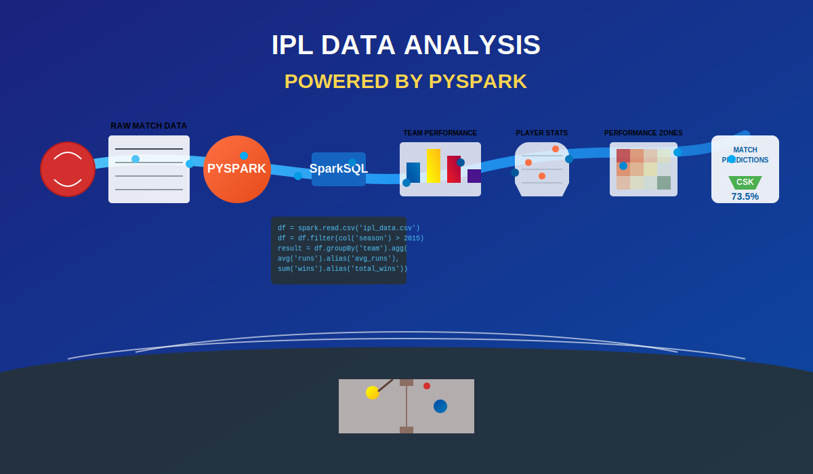

# IPL Cricket Data Analysis with PySpark

## Project Overview
This project analyzes Indian Premier League (IPL) cricket data using Apache Spark (PySpark). It demonstrates data engineering techniques, statistical analysis, and visualization of various cricket performance metrics to derive meaningful insights from the IPL seasons.

## Tools & Technologies
- **Apache Spark**: Used for distributed data processing
- **PySpark**: Python API for Spark
- **Databricks**: Used as the notebook environment
- **Matplotlib/Seaborn**: For data visualization
- **AWS S3**: For data storage

## Dataset Description
The analysis uses five distinct datasets:

1. **Ball_By_Ball.csv**: Detailed delivery-by-delivery information for each match, including runs scored, wickets, extras, etc.
2. **Match.csv**: Match-level information including teams, venue, toss details, and match results
3. **Player.csv**: Player demographics and skill information
4. **Player_match.csv**: Player-match associations and performance details
5. **Team.csv**: Team information and identifiers

## Key Features
- Data loading from S3 with optimized schema definitions
- Data cleaning and transformation
- Aggregation and window function analysis
- SQL-based analytical queries
- Statistical analysis of player and team performances
- Visualization of cricket metrics and performance indicators

## Analysis Highlights

### 1. Batting Analysis
- Identification of top-scoring batsmen per season
- Analysis of batting performance in winning matches
- Impact of batting position on run scoring

### 2. Bowling Analysis
- Identification of most economical bowlers during powerplay overs
- Analysis of wicket-taking patterns
- Bowling performance metrics

### 3. Match Insights
- Impact of winning the toss on match outcomes
- Analysis of win margins and their categorization
- Venue-specific performance metrics

### 4. Statistical Visualizations
- Distribution of scores by venue
- Dismissal type frequencies
- Team performance after winning the toss
- Player performance metrics with trend analysis

## How to Use This Project

### Prerequisites
- Apache Spark 3.x
- Python 3.6+
- PySpark SQL
- Matplotlib and Seaborn for visualizations

### Setup Instructions
1. Clone this repository
2. Set up your Spark environment (local or Databricks)
3. Update the S3 bucket paths in the notebook to point to your own data storage
4. Run the notebook cells sequentially

### Data Requirements
The data should be organized in CSV format with the expected schema. Sample row formats are shown in the schema definitions in the notebook.

## Future Work
- Implement predictive models for match outcomes
- Add real-time data processing capabilities
- Develop interactive dashboards for insights
- Extend analysis to include more recent IPL seasons
- Compare player performances across different T20 leagues

## Contribution
Feel free to fork this project, submit PRs, or suggest improvements. Any contributions to enhance the analysis or extend the capabilities are welcome.

## License
[MIT License](LICENSE)

## Contact
For any questions or collaborations, please open an issue in this repository.
